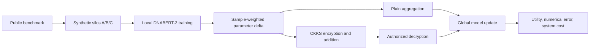

# DNABERT2-HE-Federated

**유전체 언어모델의 연합학습·암호화 집계와 학습된 가중치의 정보 노출을 분석하는 연구**

> Federated adaptation, encrypted update aggregation, and controlled memorization experiments for a genomic language model.

이 프로젝트는 유전체 모델의 개인정보 보호를 두 단계로 나누어 다룬다. 첫 번째는 여러 참여자의 학습 update를 집계할 때 노출되는 정보를 줄이는 문제다. 두 번째는 학습 이후 공개되는 모델 가중치가 입력 서열의 일부를 암기하고 복구 가능한 형태로 남기는 문제다. 두 실험군을 함께 두되, 서로 다른 위협 모델과 검증 기준을 적용한다.

| 항목 | 내용 |
|---|---|
| 기반 모델 | DNABERT-2 |
| 학습 비교 | Local/Centralized, FedAvg, FedProx, CKKS 집계; LoRA와 Full-FT |
| 개인정보 연구 | 합성 DNA canary를 이용한 통제된 암기·복구 실험 |
| 주요 기술 | Python, PyTorch, Transformers, PEFT, TenSEAL, OpenFHE 인터페이스 |
| 공개 범위 | 핵심 runner, 암호 집계 코드, 경량 테스트, 프로토콜과 선별 결과 |

## 1. 연구 질문

- 같은 update를 집계할 때 CKKS 근사 연산이 예측 성능과 수치 오차에 어떤 영향을 주는가?
- LoRA와 Full-FT는 학습 성능 외에 통신량·직렬화 크기·집계 비용에서 어떻게 다른가?
- 기관별 label 분포가 다를 때 pooled 성능과 기관별 성능을 어떻게 구분해 평가해야 하는가?
- Update를 암호화하는 것과 최종 가중치에서 정보를 복구하지 못하게 하는 것은 어떤 점에서 다른가?
- 학습 횟수·제공 문맥·대조군을 통제했을 때 합성 비밀 서열이 얼마나 복구되는가?

## 2. 연합학습·암호화 집계 구조



각 round에서 참여자는 동일한 global state로 시작한다. Local update는 표본 수에 따라 가중되며, 평문과 HE 경로의 차이를 평가할 때 seed·partition·참여자 순서·학습 budget을 맞춘다. Full-FT 경로는 전체 state를 deterministic 순서로 나누어 처리하는 streaming 집계를 사용한다. 이는 일부 파라미터를 표본화하는 방식이 아니라, 중간 ciphertext의 메모리 사용을 줄이는 구현이다.

## 3. 실험 설계

### 데이터와 기관 분할

| 데이터 | Train | Dev | Test | 역할 |
|---|---:|---:|---:|---|
| GUE_v2 EMP/H3K4me3 | 29,439 | 3,680 | 3,680 | Main benchmark |
| GUE_v2 EMP/H3K36me3 | 27,904 | 3,488 | 3,488 | 설정을 고정한 LoRA 경로의 별도 task 재현 |

A/B/C는 실제 의료기관이 아닌 **synthetic cross-silo shard**다. 공식 train/dev/test 경계 안에서 IID 및 label-skew non-IID를 구성한다. Main 비교는 paired seeds **42–46**을 사용한다. H3K4me3 test는 초기 pilot에서 이미 조회되었으므로 완전히 새로운 confirmatory holdout으로 해석하지 않는다. [본 실험 프로토콜](experiments/main_study_protocol_KO.md)

### 비교군과 평가 기준

| 경로 | 비교 목적 |
|---|---|
| Local-only LoRA | 기관별 독립 학습 기준 |
| Centralized LoRA / Full-FT | Pooled plaintext 학습 기준 |
| Plain FedAvg LoRA | 암호화하지 않은 연합 집계 기준 |
| FedProx LoRA | 비균질 데이터 조건의 추가 비교군 |
| CKKS HE-FedAvg LoRA | 저차원 적응 update의 암호 집계 |
| Plain / CKKS Full-FT FedAvg | 전체 trainable state 집계의 utility와 비용 |

초기 본 프로토콜은 Full-FT 연합 집계를 제외했다. 이후 별도로 고정한 [Full-FT 추가 실험 프로토콜](experiments/fullft_federated_addendum_protocol_KO.md)이 해당 비교를 추가한다. 두 문서는 연구 범위가 확장된 순서대로 읽어야 한다.

Primary 비교는 non-IID pooled-test AUPRC의 paired difference다. AUROC·MCC·F1·calibration 및 기관별 지표를 함께 살핀다. Full-FT 추가 실험에는 AUPRC margin **−0.005**와 one-sided **95%** lower confidence bound를 이용하는 사전 기준이 명시되어 있다. 이 기준을 정의했다는 사실과 실제 기준을 충족했다는 결과는 구분해야 한다.

### 암호 집계의 구현 조건

기록된 Full-FT 추가 실험은 TenSEAL CKKS의 polynomial modulus degree **8192**, coefficient modulus bits **[60, 40, 60]**, scale **2^40**, ciphertext당 **4,096 slots**를 사용한다. 직렬화 크기는 logical traffic이며 실제 WAN 전송 측정과 다르다. 이후 OpenFHE/threshold 관련 코드는 별도 경로로 포함되어 있다. 과거 TenSEAL 결과를 threshold 보안 검증 결과로 바꾸어 설명하지 않는다.

## 4. 합성 DNA 암기·복구 실험

이 실험은 알려진 문맥 안에 합성 비밀을 삽입하고, 학습 노출 조건과 모델 대조군을 설정한다. 학습된 비밀의 복구와 사전학습 모델이 원래 가진 예측 능력을 구분하는 것이 목적이다.

| 항목 | 기록된 조건 또는 결과 |
|---|---|
| 반복과 모델 | **5 seeds, 13 models** |
| 입력 구성 | **1,280 contexts, 2,560 synthetic canaries** |
| 대표 복구 조건 | **84 bp** 문맥과 숨긴 **3-token** 길이를 제공; 학습된 **12 bp** 비밀 |
| 320회 노출 조건 | **616/640 (96.25%)** exact recovery |
| 사전학습 모델 대조 | **0/640** |
| 같은 문맥의 미학습 비밀 대조 | **0/640** |

이 결과는 해당 조건의 합성 비밀 복구를 보여준다. 실제 환자 유전체 유출, 무문맥 전체 서열 복원, 모든 학습 데이터의 복구 가능성을 입증하는 결과로 확대하지 않는다. [프로토콜](experiments/privacy_memorization_scale_20260928/protocol_KO.md), [결과와 해석](experiments/privacy_memorization_scale_20260928/results_KO.md), [표](experiments/privacy_memorization_scale_20260928/paper_tables.md)

## 5. 코드 구조

| 파일·디렉터리 | 역할 |
|---|---|
| [run_fedhe_experiment.py](scripts/run_fedhe_experiment.py) | 초기 모델·데이터·LoRA·연합학습·CKKS 구성 |
| [run_fedhe_main_experiment.py](scripts/run_fedhe_main_experiment.py) | Full-data 비교, 비용 기록, streaming state 집계 |
| [run_fedhe_earlystop_v3.py](scripts/run_fedhe_earlystop_v3.py) | 학습 진행과 checkpoint 선택 관련 runner |
| [openfhe_threshold_ckks.py](scripts/openfhe_threshold_ckks.py) | Threshold-CKKS 인터페이스 |
| [privacy_memorization_scale_20260928/](experiments/privacy_memorization_scale_20260928/) | 데이터 준비·학습·공격·분석·검증 코드 |
| [tests/](tests/) | Streaming 집계, runner, 암호 인터페이스 검사 |

## 6. 실행 수준별 시작 방법

```bash
git clone https://github.com/CHOMINWOO1/DNABERT2-HE-Federated.git
cd DNABERT2-HE-Federated
python -m venv .venv
```

가상환경 활성화 후, 경량 인터페이스 테스트부터 확인할 수 있다.

```bash
python -m pip install numpy pytest
python -m pytest tests/test_openfhe_threshold_ckks.py -q
```

이 명령은 실제 OpenFHE 암호 연산 벤치마크를 실행하지 않는다. 전체 모델 학습에는 GUE 데이터, DNABERT-2 가중치, GPU 및 해당 HE backend가 필요하다. [requirements.txt](requirements.txt)는 원래 Windows/CUDA 환경의 기록이며 CPU나 다른 운영체제에 그대로 적용하는 범용 설치법은 아니다.

복구 실험은 [REPRODUCE.md](experiments/privacy_memorization_scale_20260928/REPRODUCE.md)의 단계 순서를 따른다. 공개본에서는 원시 GUE 데이터, 모델 가중치, checkpoint 및 per-example 복구 export를 제외했으므로 필요한 입력과 산출물을 먼저 생성해야 한다.

## 7. 검증과 해석 범위

공개본에서는 경량 threshold-interface 테스트 **3개가 통과**했다. Full GPU training, 실제 TenSEAL/OpenFHE 집계, 전체 runner 테스트를 이번 공개 과정에서 다시 실행한 것은 아니다.

연합학습 집계 보호와 최종 가중치의 정보 노출은 별개의 문제다. 암호 집계 구현만으로 학습·추론 전체의 암호화, 실제 기관 간 key isolation, 최종 모델에 대한 개인정보 보호를 보장하지 않는다. 이 저장소의 가치는 각 경계에 맞는 비교군·측정 항목·대조 실험을 구분해 구현한 데 있다.

## 공개 범위와 추가 문서

이 저장소는 원래 작업 폴더에서 핵심 코드·테스트·설정·작은 예제·대표 결과를 선별한 공개본이다. 대용량 데이터·가중치, 인증정보, 내부 실행 기록과 중복 문서 생성 산출물은 제외했다. 기존 논문·실험 수치는 기록된 결과이며 이번 README 개정에서 재측정하지 않았다.

- [실행한 검증과 한계](VALIDATION.md)
- [공개본 구성과 재사용 조건](PUBLICATION_NOTES.md)
- [인증정보와 로컬 설정 관리](SECURITY.md)

초기 공개본에는 별도 오픈소스 재사용 라이선스를 부여하지 않았다. 제3자 모델·데이터·의존성은 각 원 출처의 이용 조건을 따른다.
