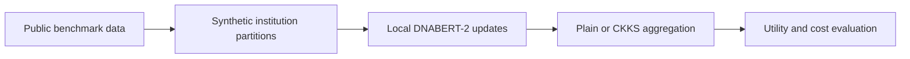

# DNABERT2-HE-Federated

**Federated adaptation, encrypted update aggregation, and controlled memorization experiments for a genomic language model.**

DNABERT-2의 연합학습에서 정확도·암호연산·통신 비용을 비교하고, 최종 가중치의 서열 암기·복구 가능성을 별도의 통제 실험으로 분석합니다.

## Two connected research tracks

1. **Encrypted federated learning:** compare centralized/local training, FedAvg, FedProx, and CKKS-encrypted update aggregation; evaluate LoRA and full fine-tuning on epigenetic-mark classification.
2. **Memorization and recovery:** investigate recovery of deliberately inserted synthetic DNA secrets under a specified context and exposure protocol.



## Selected evidence

- [Federated main-study protocol](experiments/main_study_protocol_KO.md)
- [Full fine-tuning aggregation protocol](experiments/fullft_federated_addendum_protocol_KO.md)
- [Memorization protocol](experiments/privacy_memorization_scale_20260928/protocol_KO.md), [results](experiments/privacy_memorization_scale_20260928/results_KO.md), and [reproduction steps](experiments/privacy_memorization_scale_20260928/REPRODUCE.md)

The recorded memorization study includes **5 seeds, 13 models, 1,280 contexts, and 2,560 synthetic canaries**. Under its 320-exposure condition, with 84 bp context and hidden 3-token length supplied, exact recovery of a trained 12 bp secret was **616/640 (96.25%)**; the pretrained and matched untrained-secret controls were **0/640**. This is evidence about that controlled setting, not a demonstration of patient-genome leakage or context-free reconstruction of a complete genome.

## Code map

| Location | Purpose |
|---|---|
| `scripts/run_fedhe_experiment.py` | Original LoRA/federated/CKKS runner |
| `scripts/run_fedhe_main_experiment.py` | Full-data comparisons and streaming full-model aggregation |
| `scripts/openfhe_threshold_ckks.py` | Threshold-CKKS support |
| `experiments/privacy_memorization_scale_20260928/` | Controlled memorization implementation and selected results |
| `tests/` | Aggregation, runner, and cryptographic-interface regression tests |

## Lightweight verification

```bash
python -m pip install numpy pytest
python -m pytest tests/test_openfhe_threshold_ckks.py -q
```

This verifies interface/logic behavior and does not benchmark a real OpenFHE backend. Full experiments require the GPU/model/data stack and the appropriate HE backend. `requirements.txt` records the original Windows/CUDA environment; it is not a portable CPU installation recipe. Raw GUE data, pretrained weights, checkpoints, and per-example recovery exports are excluded.

## Threat-model boundaries

Synthetic silos are not real institutional federation. CKKS aggregation does not mean all training or inference happens under encryption. Transport/update protection and privacy of a released final model are separate questions. Historical TenSEAL experiments and later threshold/OpenFHE code should not be treated as the same security configuration.

## Publication and validation

This is a curated research source snapshot, not the complete local experiment archive.
See [validation](VALIDATION.md), [publication scope](PUBLICATION_NOTES.md), and [credential handling](SECURITY.md).
