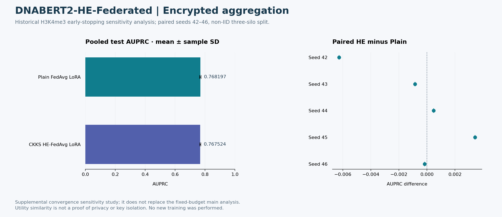

# 연합학습·동형암호: 결과와 진행 상태



## 결과와 해석

[5-seed 원자료·결과표](../earlystop_results/RESULTS.md)는 H3K4me3 non-IID LoRA-FL의 보강 수렴 민감도 분석이다. Plain의 DEV 기반 선택 round를 같은 seed의 HE에 적용한 조건이다. 원 CSV의 hash를 기존 완료 기록과 대조한 뒤 표와 그림을 만들었다. 기존 고정 5-round 주 분석을 대체하지 않으며 이번 작업에서 학습을 다시 수행하지 않았다.

## 진행 상태와 보완

| 항목 | 상태 |
|---|---|
| LoRA / Full-FT·CKKS 집계 코드 | 구현과 프로토콜 공개 |
| 수렴 민감도 분석 | 5 seeds × 2 methods의 완료된 집계 결과 공개 |
| 공개본 경량 검증 | threshold-interface 3개 테스트 통과 |
| 실제 GPU·HE backend 재실행 | 이번 공개 과정에서 미실행 |
| 실제 기관 분포·키 분리 | 별도 평가 필요 |

다음 보완은 실제 backend의 비용 재측정, 기관별 utility·calibration 비교, 실제 통신 및 키 관리 경계 검증이다. 평균 성능의 유사성만으로 비열등성이나 개인정보 보호를 확정하지 않는다.

## 보안 경계

집계 update 암호화와 최종 모델의 암기는 다른 문제다. 최종 가중치의 학습정보 복구 연구는 [별도 저장소](https://github.com/CHOMINWOO1/DNABERT2-Genomic-Data-Recovery)로 분리했다. 비밀 키·환자 데이터·모델 checkpoint는 포함하지 않는다. Synthetic silo 실험을 실제 기관 간 key isolation 검증으로 해석하지 않는다.

## 그림 재현

```bash
python -m pip install matplotlib
python docs/portfolio-results/reproduce_figures.py
```

[수치](metrics.json) · [SVG](results.svg) · [프로토콜](../earlystop_results/protocol_KO.md) · [검증 범위](../../VALIDATION.md)
